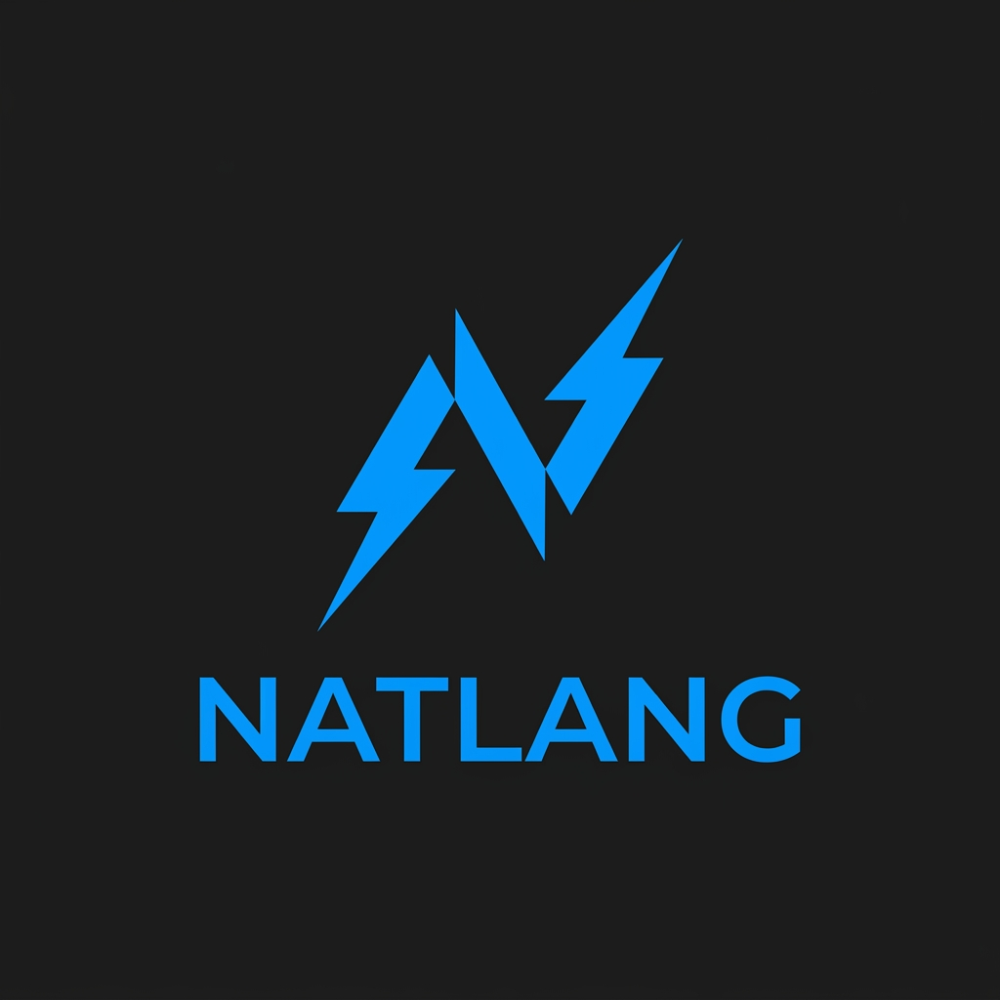

# NatLang: Natural Language to Code Extension for VS Code

  
  
  

NatLang is a powerful Visual Studio Code extension that allows developers to write logic in plain English pseudocode and instantly generate production-ready code in over 30 programming languages. It leverages advanced AI models from Ollama, Anthropic, Gemini, and OpenAI to provide accurate, real-time code generation directly within the editor.

## Key Features

*   **Real-time Code Generation**: Transform pseudocode into functional code with a single shortcut (Ctrl+Shift+G).
*   **Live Token Streaming**: Observe the code being written in real-time within the editor and the dedicated sidebar.
*   **Multi-Provider Support**: Choose between local execution via Ollama or cloud-based APIs including Claude 3.5, Gemini 2.0, and GPT-4.
*   **Integrated Sidebar Dashboard**: Manage target architectures, switch AI providers, and view real-time generation progress through a professional systems architecture interface.
*   **Project-Wide Context**: The engine understands file context and can generate language-specific idioms (e.g., React hooks, Java OOP patterns).
*   **CodeLens Integration**: Trigger generation directly from the editor margins using embedded UI elements.

## Getting Started

### Installation

1.  Download and install the NatLang extension from the VS Code Marketplace.
2.  Ensure you have a supported AI provider configured.

### Configuration

#### Using Ollama (Local)

1.  Download and install [Ollama](https://ollama.com).
2.  Run `ollama pull codellama` in your terminal.
3.  The extension will automatically connect to the default local address (`http://localhost:11434`).

#### Using Cloud Providers

1.  Open the Command Palette (Ctrl+Shift+P).
2.  Search for "NatLang: Set API Key".
3.  Select your provider (Anthropic, Gemini, or OpenAI) and paste your API key. Keys are stored securely using the VS Code Secrets API.

### Usage

1.  Create a new file with the `.nl` extension or open any text file.
2.  Write your logic in plain English (e.g., "create a function that calculates the factorial of a number").
3.  Press **Ctrl+Shift+G** or use the "NatLang: Generate Code" command from the context menu.
4.  The pseudocode will be replaced by the generated code in your target language.

## Supported Languages

NatLang supports a wide array of programming environments:

*   **Web**: JavaScript, TypeScript, HTML, CSS, React JSX, Vue.
*   **Systems**: C, C++, C#, Rust, Go, Swift, Kotlin, Java.
*   **Scripting**: Python, Ruby, PHP, Lua, Perl.
*   **Data & Science**: R, Julia, MATLAB, SQL.
*   **Shell**: Bash, PowerShell.
*   **Others**: Haskell, Elixir, Scala, Dart, Zig.

## Extension Commands

*   `natlang.generate`: Generates code from the current selection or block.
*   `natlang.changeLanguage`: Opens a selection menu to change the target programming language globally.
*   `natlang.setApiKey`: Securely saves an API key for cloud-based providers.
*   `natlang.newFile`: Creates a new `.nl` file with a starter template.
*   `natlang.clearHistory`: Clears the local generation history from the sidebar.

## Settings

The extension can be customized through VS Code Settings (User Settings -> Extensions -> NatLang):

*   `natlang.aiProvider`: Choose the primary AI engine (Ollama, Anthropic, Gemini, OpenAI).
*   `natlang.defaultLanguage`: Set the default target language for all new projects.
*   `natlang.ollamaBaseUrl`: Customize the endpoint if Ollama is running on a remote server.
*   `natlang.ollamaModel`: Specify which Ollama model to use.

## License

This project is licensed under the MIT License - see the [LICENSE](LICENSE) file for details.
