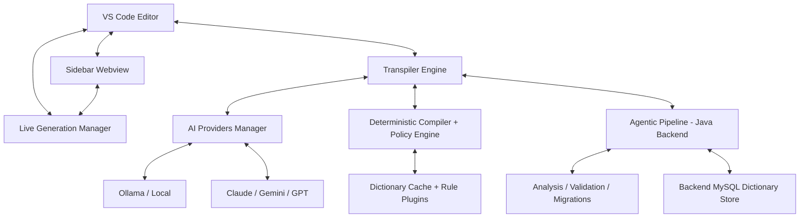

  

  

# NatLang: The Intelligence-Driven Transpilation Engine

NatLang is a professional-grade Visual Studio Code extension designed to bridge the gap between natural language logic and production-ready implementation. By treating pseudocode as a first-class citizen, NatLang enables developers to architect systems using plain English while the underlying engine handles the complexities of syntax, idioms, and multi-language transpilation.

---

##  Technical Ecosystem (Stack)

NatLang is built on a high-performance, distributed architecture ensuring stability and speed.

- **Frontend/Extension**: TypeScript with VS Code API and a Webview-driven Modern Dashboard.
- **Transpilation Engine**: Interface-driven logic supporting SSE (Server-Sent Events) and JSON streaming.
- **Backend (Agentic AI)**: Java-based orchestration for deep code analysis and logical validation.
- **AI Core**: Native multi-provider support:
  - **Local**: Ollama (default model: `gemma3:4b`).
  - **Cloud**: Anthropic Claude 3.5, Google Gemini 1.5 Pro/Flash, Groq-hosted Llama, OpenAI GPT-4o.
- **Build & CI**: esbuild, ESLint, GitHub Actions (for deployment).

---

##  Core Philosophy

Traditional AI assistants often generate code based on localized completion patterns. NatLang shifts this paradigm by utilizing a dedicated Transpilation Engine that processes logical intent into functional code across more than 30 programming environments. This ensures that the generated output is not just syntactically correct, but architecturally sound and idiomatic to the target environment.

##  Principal Features

### Real-time Pulse Streaming
Experience instantaneous feedback with live token streaming. As the AI processes your logic, the code is typed directly into your editor and reflected in the sidebar dashboard, providing a transparent view of the generation process.

### Live Typing Preview
Turn on **NatLang: Toggle Live Generation Preview** to keep typing pseudocode while NatLang streams a side-by-side generated code document in real time. NatLang now generates line by line, rechecks each step, detects format drift automatically, and stops itself if it starts repeating the same output.

- The sidebar now includes a compact live preview switch so you can enable or disable the mode without leaving the panel.
- When you switch the target language, the live preview follows that language automatically.

### Systems Architecture Dashboard
The integrated sidebar provides a high-fidelity interface for managing your AI orchestration. 
- **Target Selection**: Quickly switch between programming languages and frameworks.
- **Provider Management**: Toggle between local LLMs (Ollama) and cloud-based providers (Gemini, Anthropic, Groq, OpenAI).
- **Processing Monitor**: Track real-time metadata including complexity analysis and generation progress.

### Agentic AI Pipeline
Beyond simple generation, NatLang offers an advanced Agentic Pipeline powered by a high-performance Java backend. This secondary channel provides:
- **Logical Validation**: Analyzes the generated code for structural integrity.
- **Complexity Metrics**: Real-time evaluation of code modularity and performance.
- **Optimization Suggestions**: Automated refactoring recommendations for improved efficiency.
- **Project-Wide Context**: Deeper integration with your existing codebase for coherent expansion.
- **Provider Resilience**: Retries generation, optimization, and explanation with the heuristic provider when the preferred provider fails.
- **Credential Sync**: API keys entered in the extension are stored in SecretStorage and mirrored into the backend local override file.

---

##  System Architecture

The extension is built on a modular, interface-driven architecture to ensure stability and extensibility.

### 1. Transpiler Engine
The central hub for all operations. It manages the lifecycle of a generation request, including:
- History persistence and context management.
- Real-time token stripping to ensure clean code output.
- Concurrency control for simultaneous editor and sidebar updates.

---

##  Getting Started

### Prerequisites
- Visual Studio Code v1.80.0 or higher.
- For local execution: [Ollama](https://ollama.com) installed and running.
- For Agentic Pipeline: Java Runtime Environment (JRE) 21 or higher.

### Installation
1. Search for **NatLang** in the VS Code Marketplace.
2. Click **Install**.
3. Open the Dashboard using the NatLang icon in the Activity Bar.

---

##  Configuration Reference

| Setting | Description | Default |
|---------|-------------|---------|
| `natlang.aiProvider` | Primary AI engine for generation | `Ollama` |
| `natlang.defaultLanguage` | The initial target language | `Python` |
| `natlang.ollamaModel` | The local model to invoke | `gemma3:4b` |
| `natlang.groqModel` | The Groq model to invoke | `llama-3.3-70b-versatile` |
| `natlang.backendBaseUrl` | Endpoint for the Agentic AI API | `http://localhost:9001` |
| `natlang.liveGenerationDebounceMs` | Delay before live preview refreshes after typing | `650` |
| `natlang.liveGenerationContextLines` | Context lines NatLang includes for each live generation step | `3` |
| `natlang.liveGenerationMaxLineRetries` | Recheck/retry limit for a single live preview line | `2` |
| `natlang.liveGenerationMaxLinesPerStep` | Max generated lines accepted per live step | `4` |

##  Deterministic Engineering Features

NatLang now includes a non-AI deterministic pipeline for teams that need reproducibility and governance.

- **Deterministic Compiler Pipeline**
  - Commands: **NatLang: Compile Deterministic**, **NatLang: Scrape Dictionary (AI + Heuristics)**, **NatLang: Refresh Dictionary From Backend**
  - Compiles supported pseudocode patterns into deterministic `Python`, `JavaScript`, or `TypeScript` output.
  - Dictionary-driven normalization is applied before parsing to improve phrase coverage.
  - Scraped dictionary entries are ingested into backend DB and cached locally.
  - Automatic learning from successful AI generations is enabled by default (`natlang.autoLearnDictionaryFromGeneration`).

- **Policy-as-Code Enforcement**
  - Commands: **NatLang: Open Policy File**, **NatLang: Validate Current File Policy**, **NatLang: Lock Policy Pack**, **NatLang: Verify Policy Pack**, **NatLang: Switch Policy Profile**
  - Policy file location: `.natlang/policies/<profile>.json`
  - Active profile config: `.natlang/profile.json`
  - Integrity lock file: `.natlang/policy.lock`
  - Supports `schemaVersion` and `mode` (`enforce` or `warn`) for controlled rollout.
  - Compilation and migration operations are blocked when policy violations are detected in `enforce` mode.

- **Transactional Apply + Rollback**
  - Commands: **NatLang: Begin Transaction**, **NatLang: Commit Transaction**, **NatLang: Rollback Transaction**, **NatLang: Recover Transaction**
  - Deterministic compile and migration runs apply edits inside a transaction and rollback on failure.
  - Active transactions are persisted and recoverable after extension restart/crash.
  - Multi-file transactional journals are written under `.natlang/transactions`.

- **AST Diff and Transform Audit**
  - Command: **NatLang: Show Deterministic AST Diff**
  - Shows source AST, compiler transformation trace, and output preview.

- **Rule Plugin System**
  - Command: **NatLang: Scaffold Rule Plugin**
  - Plugin folder: `.natlang/plugins/*.json`
  - Supports `preParse` and `postEmit` regex transforms.

- **Migration Factory**
  - Commands: **NatLang: Preview Migration Pack**, **NatLang: Run Migration Pack**
  - Built-in packs:
    - `javascript-modernize`
    - `typescript-modernize`
    - `java-modernize`
    - `python-modernize`
  - Includes risk score and changed-lines estimation before apply.

- **Ownership-Aware Guardrails**
  - Command: **NatLang: Configure Owner Approvals**
  - Reads `CODEOWNERS` (root or `.github/CODEOWNERS`) and enforces approval tokens for guarded files.

- **Pre-Commit Policy Hook**
  - Command: **NatLang: Install Pre-Commit Policy Hook**
  - Installs a Git hook that checks staged files against the active policy profile.

- **Deterministic Regression Guard**
  - Commands: **NatLang: Run Deterministic Self-Test**, **NatLang: Run Deterministic Benchmark**, **NatLang: Capture Deterministic Baseline**, **NatLang: Detect Deterministic Drift**
  - Runs deterministic compiler fixture tests and reports pass/fail in the output channel.
  - Captures baseline outputs and flags drift across versions.

---

##  Lead Developer & Project Architect

**Harsh Bavaskar** ([@HarshBavaskar](https://github.com/HarshBavaskar))
Main contributor and architect of the NatLang Transpilation Engine.

---

##  License

---

This project is licensed under the MIT License. See the [LICENSE](LICENSE) file for details.

