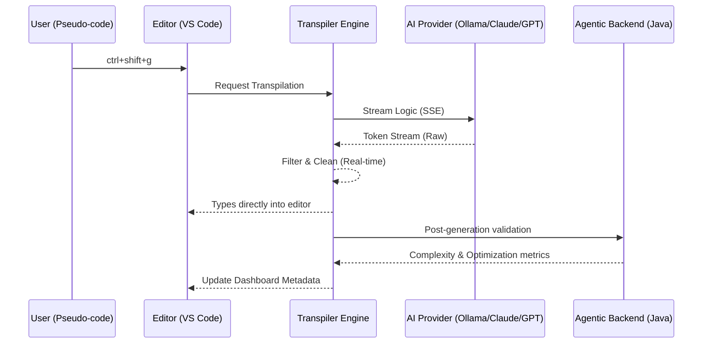

  

# NatLang Technical Wiki Portal

Welcome to the **NatLang Technical documentation Hub**. This Wiki is designed for developers and power users who want a deep understanding of the engine's mechanics, architecture, and core Java/TypeScript implementations.

## 📁 Technical Deep-Dives

Explore specialized documentation for every layer of the NatLang ecosystem:

### ⚙️ [Backend Implementation](docs/wiki/backend-implementation.md)
*   **3-Layer Architecture**: Controller, Service, and DAO patterns.
*   **Agentic Logic**: Post-generation validation and feedback loops.
*   **JDBC-First Persistence**: High-speed MySQL interaction logic.

### 🚀 [Frontend Implementation](docs/wiki/frontend-implementation.md)
*   **SSE Streaming**: Real-time token delivery and "Preamble Filtering".
*   **Webview Messaging**: Bi-directional communication between VS Code and the Sidebar Dashboard.
*   **Provider Pattern**: Unified interface for local and cloud AI models.

### 🌟 [Advanced Java Concepts](docs/wiki/java-concepts.md)
*   **Java 21 Features**: Stream API, records, and pattern matching.
*   **Spring Boot 3**: Constructor-based DI, Jakarta validation, and REST patterns.
*   **Tool Orchestration**: How the backend uses specialized tools for code analysis.

---

## 🏗️ System Architecture Overview

NatLang is built on a modular, interface-driven design.

### Quick Navigation
*   **[Installation Guide](README.md#setup)**: Get up and running in minutes.
*   **[Contributing](CONTRIBUTING.md)**: Help us build the future of natural language programming.
*   **[FAQ](README.md#faq)**: Common questions and troubleshooting.

---

> [!NOTE]
> This documentation is maintained by the **NatLang core team**. If you discover any inaccuracies or would like to propose a new feature, please open an issue or pull request.
