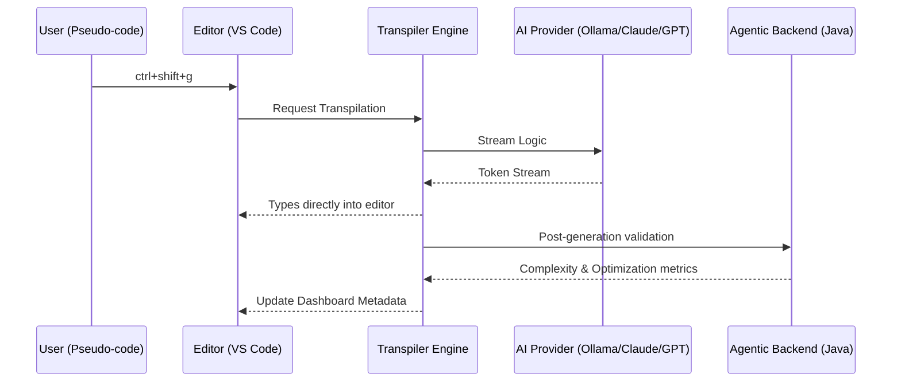

<p align="center">
  
</p>

# NatLang Wiki: Technical Documentation & Implementation Details

[](package.json)
[](LICENSE)
[](https://github.com/HarshBavaskar/natlang-vscode/graphs/commit-activity)

Welcome to the NatLang Wiki. This document provides an in-depth technical overview of the NatLang VS Code extension, covering architecture, customization, and troubleshooting.

##  Project Architecture

The NatLang extension follows a modular, interface-driven design.



### Core Components

*   **TranspilerEngine.ts**: The central processing hub. It manages history, coordinates between AI providers, and handles the logic for stripping and formatting tokens during streaming.
*   **PromptBuilder.ts**: Constructs multi-layered system and user prompts that provide the AI with specific context about target languages, coding standards, and project structure.
*   **SidePanelProvider.ts**: Manages the Webview-based sidebar. It functions as a complete dashboard for target architecture and provider configuration.
*   **Agentic Orchestrator**: Interfaces with the Java backend to provide secondary validation and optimization.

---

##  Agentic AI Pipeline (Java Backend)

The Agentic Pipeline is what sets NatLang apart from standard AI assistants. It doesn't just generate; it validates.

### Technical Specification
- **Engine**: Spring Boot / Jakarta EE compatible.
- **Port**: 8080 (Configurable).
- **Functionality**:
    - **AST Analysis**: Parses generated code to ensure logical consistency.
    - **Cyclomatic Complexity**: Measures code modularity.
    - **Idiomatic Score**: Ranks how well the code follows target language standards.

---

##  Supported AI Providers

| Provider | Mechanism | Recommended Model |
|----------|-----------|------------------|
| **Ollama** | Local HTTP (11434) | `codellama`, `deepseek-coder` |
| **Anthropic** | SSE / Content Block Delta | `claude-3-5-sonnet` |
| **Gemini** | SSE / streamGenerateContent | `gemini-1.5-pro` |
| **OpenAI** | SSE / data chunks | `gpt-4o` |

---

##  FAQ & Troubleshooting

### Q: Why is my code wrapped in ``` backticks?
**A:** This happens if the AI model ignores the system prompt. NatLang's `TranspilerEngine` has a token-stripping regex, but minor inconsistencies can occur with smaller local models. Switch to a "Coder" specific model for best results.

### Q: "NatLang failed to connect to backend"
**A:** Ensure your `natlang.backendBaseUrl` is correct and the Java Agentic AI service is running. If you aren't using the agentic features, you can ignore this warning or disable it in settings.

### Q: How do I add a new language?
**A:** Language support is dynamic. The `PromptBuilder` uses the `targetLanguage` state to set the context. You can select any language from the Dashboard dropdown.

---

##  Common Error Codes

| Code | Meaning | Resolution |
|------|---------|------------|
| `NL-401` | Unauthorized | Check your API Key in `NatLang: Set API Key` |
| `NL-503` | Provider Offline | Ensure Ollama is running or check internet connection |
| `NL-PARSE-ERR` | Logic Mismatch | The pseudo-code was too ambiguous for the engine. |

---

##  Contribution Guide

If you'd like to extend NatLang:
1.  Fork the repository.
2.  Install dependencies: `npm install`.
3.  Compile: `npm run compile`.
4.  Launch in Debug mode (F5).
